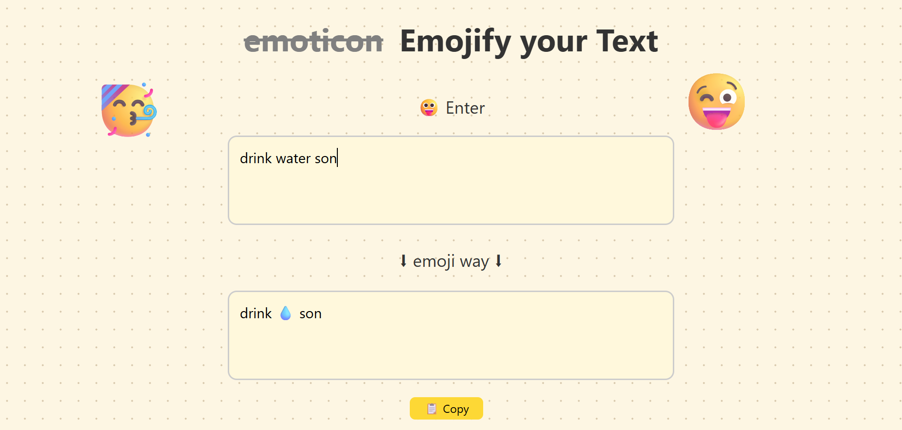

# Emoji Translator 🎨

A fun and interactive web application that translates text into emojis! 🌟

## 🧠 Project Overview

The Emoji Translator is a user-friendly web application designed to convert text into corresponding emojis. It provides a simple interface where users can input text, and the application translates each word into an emoji where possible. The application also includes a convenient copy feature to share the translated text easily.

### 🚀 Features

- **Real-Time Translation**: Translate text into emojis as you type.
- **Comprehensive Emoji Dictionary**: Hundreds of words mapped to their emoji equivalents.
- **Copy to Clipboard**: Easily copy translated text with a single button click.


## 🛠️ Tech Stack

- **Frontend**: 
  - HTML5
  - CSS3 (in style.css)
  - JavaScript (ES6+)
- **Build Tools**: 
  - None required for this project
- **Browser APIs**: 
  - Clipboard API for copy functionality
- **Other**: 
  - Emoji Dictionary (custom mapping)

## 📦 Installation

1. **Clone the Repository**:
   ```bash
   git clone https://github.com/Vinitkumar90/emojify-text
   ```
2. **Open in Browser**:
   - Since this is a static site, you can open `index.html` directly in a web browser.

## 💻 Usage

1. **Input Text**: Type or paste your text into the input textarea.
2. **Translate**: The application automatically translates your text into emojis.
3. **Copy**: Click the "Copy" button to copy the translated text to your clipboard.
4. **Share**: Paste the copied text wherever you like!

## 📂 Project Structure

```plaintext
emoji-translator/
├── index.html
├── script.js
└── style.css
```

## 📸 Screenshots




